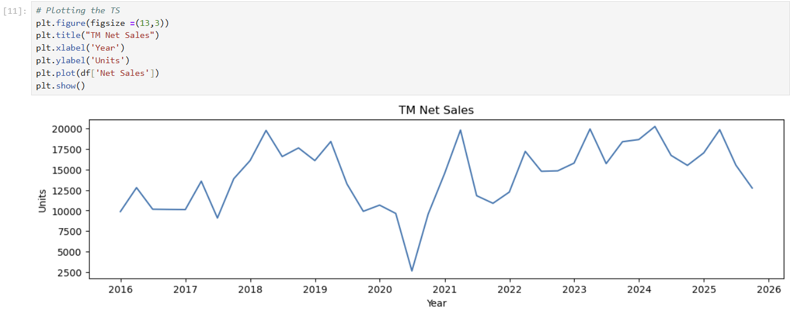
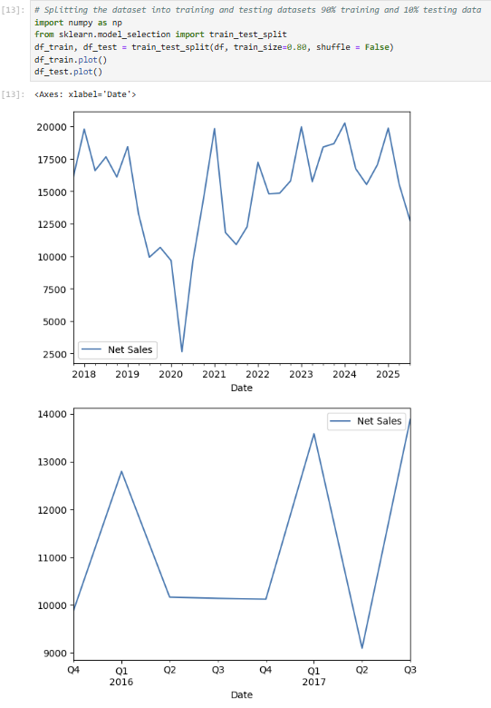
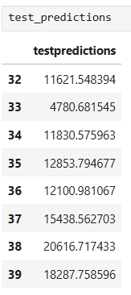
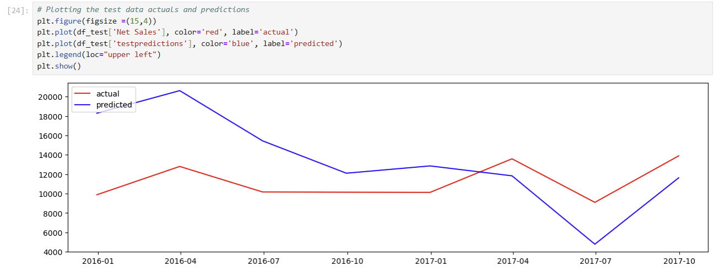
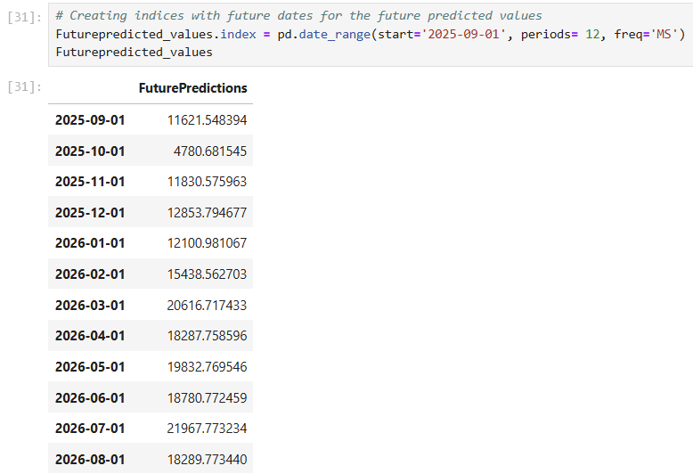
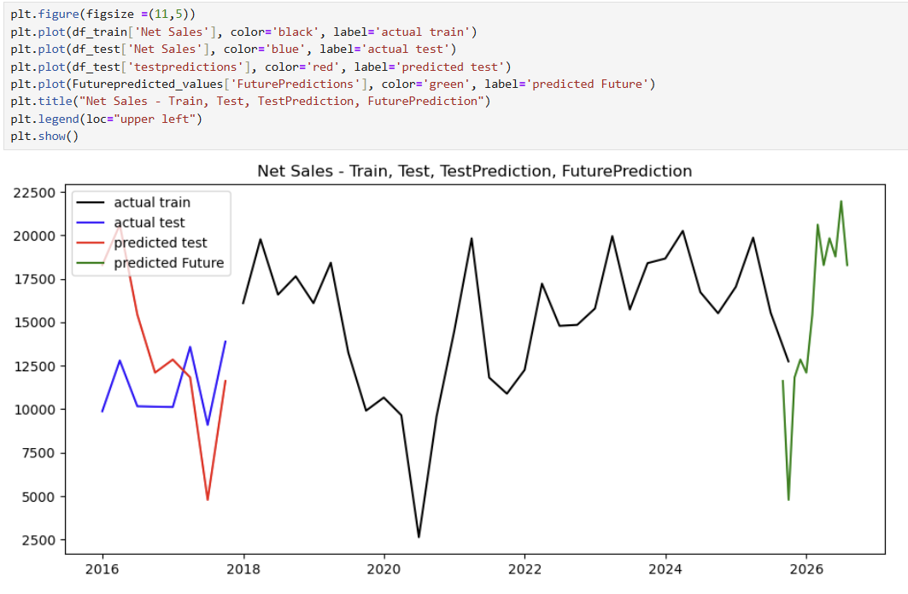

# Tata-Sales-Forecasting
Sales forecasting project using Python, ARIMA model, and time-series analysis to predict Tata Motors sales trends.

## Project Overview
This project focuses on forecasting Tata Motors sales trends using Python and ARIMA time-series forecasting techniques. Historical sales data was analyzed to predict future sales performance.

**Objective**
To analyze sales trends and develop a forecasting model for future Tata Motors sales prediction.

**Tools & Technologies Used**
- Python
- Pandas
- NumPy
- Matplotlib
- Statsmodels
- ARIMA Model
- Jupyter Notebook

**Key Features**
- Time-series analysis
- Sales trend visualization
- ARIMA forecasting
- Future sales prediction
- Actual vs Predicted comparison

**Methodology**
1. Data preprocessing
2. Date conversion
3. Stationarity testing using ADF Test
4. Train-test split
5. ARIMA model development
6. Future forecasting
7. Model evaluation

**Forecasting Techniques**
- ARIMA
- Auto ARIMA
- Time-Series Forecasting

**Key Insights**
- Sales trends showed seasonal fluctuations
- Forecasting model identified future sales patterns
- Predictive analytics improved sales forecasting understanding

**Project Files**
- Excel Dataset (.xlsx)
- Forecasting Documentation (.pdf)
- Jupyter Notebook (.ipynb)

**Forecasting Visualizations**

**TM Net Sales**

**TM Train & Test Split**

**TM Test Predictions**

**TM Actual vs Predicted**

**TM Future Predictions**

**TM Future Forecast**

